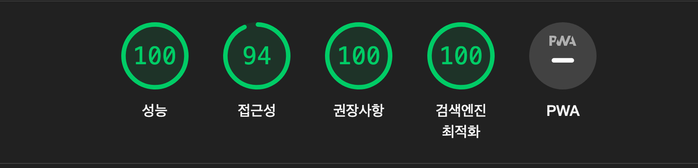

# Blog-Project

## 목적

- Nextjs 13버전을 활용한 개인 블로그 만들기

## 배포

https://soyeah-log.vercel.app/

## 구현기능

- md viewer를 활용한 생성된 게시글 보기
- md editor를 활용한 게시글 생성
- firebase를 활용한 DB

## 버전

0.0.1(MVP. 2023-04-12)

> 초기 동작 모델

0.0.2(2023-04-20)

> Viewer CSS 수정

0.0.3(2023-04-20)

> Contact Page 삭제
> Contact 요소는 메인 화면으로 가지고 옴

0.0.4(2023-04-20)

> 반응형 일부 수정
> 로고 반응형 추가
> post 1024px 사이즈 대응

## Lighthouse 최적화 점수

