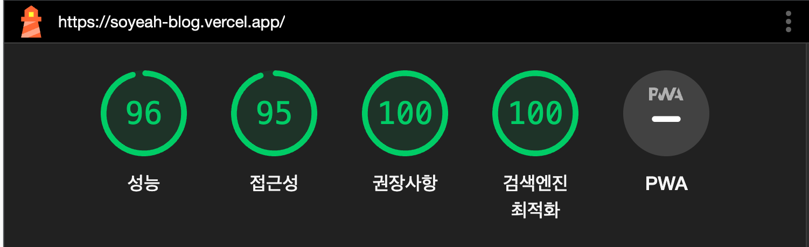

# Blog-Project

## 프로젝트 간단 소개

Next.js 를 활용한 블로그 프로젝트로 회원가입을 통한 좋아요 및 북마크 기능 및 프로젝트 소유자에 한하여 에디터 기능을 제공하는 형태로 고도화를 하였습니다. 기존 프로토타입의 블로그에서는 Firebase를 활용하여 데이터를 관리하였으나 고도화를 하면서 Next.js의 서버 기능과 Sanity(CMS)를 활용하여 Firebase를 대체하였습니다.

## 배포

프로토타입 : https://soyeah-log.vercel.app/ (추후 폐쇄 예정)<br/>
프로덕션 : https://soyeah-blog.vercel.app/

### 실행 방법

```
$ yarn build && yarn start
```

### 구현 기능

- Next.js 와 Sanity를 활용한 Data 관리
- NextAuth 를 활용한 카카오/구글 OAuth 회원가입 및 로그인
- 로그인 정보를 기반으로 한 북마크 및 좋아요 기능
- 페이지 로드를 기반으로 한 포스트 조회 수
- SWR을 활용하여 데이터 패칭 및 좋아요, 북마크 등 서버 데이터에 따른 느린 UI 변화에 대해 OptimisticData 를 활용해 대응
- Toast UI 에디터 내 Base64 기반 사진 업로드를 Sanity CDN을 활용한 URL업로드로 변경
- 로컬 스토리지를 활용한 작성 중 포스트 임시저장 기능
- 디바운스를 적용한 검색 기능

---

### 추가 구현 예정 기능 (1.0.0 버전)

- 댓글 기능
- 모바일/태블릿 대응을 위한 반응형 UI
- 필터
- 페이지네이션
- 커스텀 뷰어 CSS
- 인기 포스트
- 리팩토링

---

## Lighthouse 최적화 점수



---

## 주요 기능 소개 및 GIF

### 소셜 로그인/로그아웃

Nextauth를 활용하여 구현한 OAuth 간편 로그인입니다. 카카오와 구글 두가지의 계정을 활용했으며, 오너 계정이냐 아니냐에 따라서 노출되는 메뉴가 다릅니다.


### 북마크와 좋아요

로그인 후 좋아요나 북마크를 누를 수 있으며, 좋아요의 경우는 추후 인기 게시글 구현을 위해 수집되게 되고, 북마크는 각 아이디 별로 개인화된 북마크 페이지를 확인할 수 있도록 했습니다. 또한 서버에서 데이터가 돌아오는 데까지 시간이 소요되어 클라이언트에는 즉각적으로 UI변경이 일어날 수 없다는 점때문에 SWR의 optimistic data 기능을 활용해 UI가 서버의 데이터를 불러들이는 것과는 상관없이 즉각적으로 변경될 수 있도록 했습니다.


### 에디터

Toast UI Editor를 활용하였으며, 기존 BASE64로 업로드되는 이미지 업로드 로직을 제거하고 Sanity를 통해 CDN서버에 저장한 후 URL을 반환할 수 있도록 로직을 작성해 적용하였습니다. 또한 로컬스토리지를 활용한 임시저장 기능을 만들어 불가피하게 포스트를 마무리 하지 못했을 때 저장할 수 있도록 하였습니다.
UX/UI는 Velog의 에디터을 모티브로 하여 제작되었으며, 모달을 활용해 description과 thumbnail을 추가 작성할 수 있도록 하였습니다.


### 포스팅

CMS 서비스인 Sanity를 활용해 기존 사용하던 파이어베이스를 대체하였습니다. 포스팅 시에는 살짝의 딜레이는 있으나 데이터를 받아오면 클라이언트에서 렌더링할 수 있도록 SSR페이지로 포스트 페이지를 구성했습니다. 조회수와 좋아요 등도 포스트탭에서 업데이트 되어 보이도록 하였습니다.


### 검색 기능

입력되는 키워드에 따라 서버에서 DB에 데이터를 요청할 때 검색결과에 해당하는 값을 불러들이도록 하는 간단한 로직을 적용한 검색 기능입니다. 디바운싱을 통해 불필요한 API요청을 방지하도록 하였습니다.


---

## 버전

v0.0.1(MVP. 2023-04-12)

> 초기 동작 모델

v0.0.2(2023-04-20)

> Viewer CSS 수정

v0.0.3(2023-04-20)

> Contact Page 삭제 <br/>
> Contact 요소는 메인 화면으로 가지고 옴 <br/>

v0.0.4(2023-04-20)

> 반응형 일부 수정<br/>
> 로고 반응형 추가<br/>
> post 1024px 사이즈 대응<br/>

0.1.0(2023-07-11)

> 소셜 로그인 기능을 기반으로 한 북마크 및 좋아요 <br/>
> 페이지 로드를 기반으로 한 포스트 조회 수 <br/>
> 로컬스토리지를 활용한 포스트 임시저장 기능 <br/>
> Firebase -> Sanity로 DB 이전 <br/>
> 현재 반응형 미구현 상태로 추가로 구현 예정 <br/>
> 기존 에디터 BASE64 기반 이미지 업로드를 URL기반 업로드로 변경 <br/>

---
